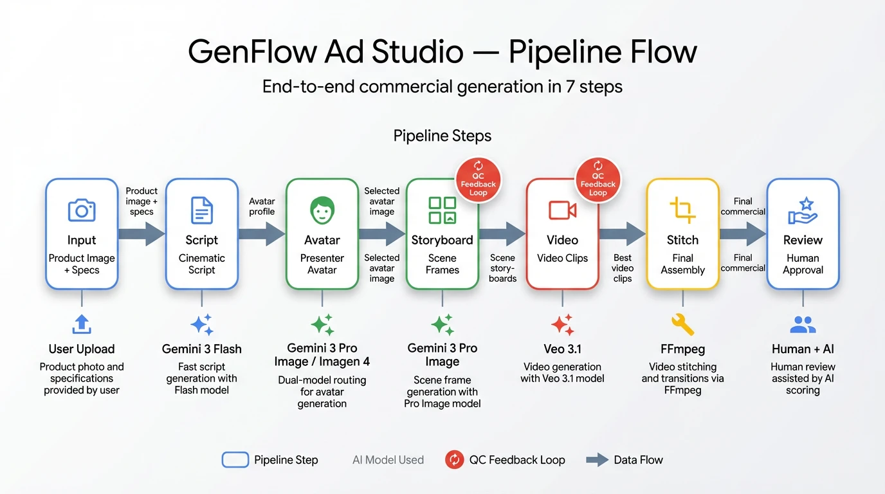
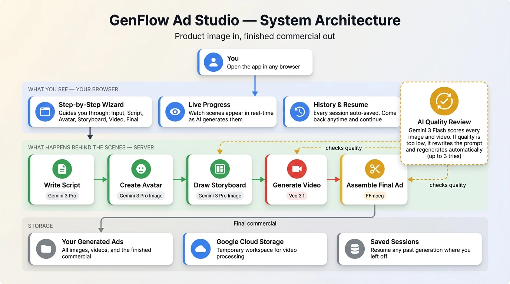

<div align="center">

# Genflow Ad Studio

**AI-powered video commercial generator.**
Product image in, finished 30-second ad out.

Built with [Gemini 3 Pro](https://ai.google.dev/) | [Veo 3.1](https://deepmind.google/technologies/veo/) | [Imagen 4](https://deepmind.google/technologies/imagen/) | [FFmpeg](https://ffmpeg.org/)

<br>



</div>

---

Upload a product photo, and the pipeline writes a cinematic script, generates a photorealistic presenter, creates scene-by-scene storyboards, produces video clips with scene-to-scene continuity, stitches everything into a final commercial with transitions and normalized audio, and presents it for human review -- all powered by Google's latest generative AI models.

<br>

## Quick Start

```bash
# 1. Clone
git clone https://github.com/lavinigam-gcp/genflow-ad-studio.git
cd genflow-ad-studio

# 2. Authenticate with Google Cloud
gcloud auth application-default login
gcloud auth application-default set-quota-project YOUR_PROJECT_ID

# 3. Configure
cp .env.example .env
# Edit .env — set PROJECT_ID and GCS_BUCKET_NAME

# 4. Install & run
make setup    # Installs deps, creates GCS bucket, generates sample images
make dev      # Starts backend (8000) + frontend (3000)
```

Open **http://localhost:3000** and start generating.

<br>

## Prerequisites

| Requirement | Install |
|:--|:--|
| Python 3.11+ | [python.org](https://www.python.org/downloads/) |
| Node.js 18+ | [nodejs.org](https://nodejs.org/) |
| FFmpeg | `brew install ffmpeg` (macOS) |
| Google Cloud SDK | [cloud.google.com/sdk](https://cloud.google.com/sdk/docs/install) |
| Vertex AI APIs | Enable in your GCP project console |

<br>

## How It Works

<table>
<tr>
<th width="140">Step</th>
<th>What Happens</th>
<th width="200">Model</th>
</tr>
<tr>
<td><a href="asset/product-input.webp"><strong>1. Input</strong></a></td>
<td>Upload product image (URL, file, or AI-generated), provide specs, select 2-6 scenes</td>
<td>Gemini 3 Flash</td>
</tr>
<tr>
<td><a href="asset/script-generation.webp"><strong>2. Script</strong></a></td>
<td>AI Ad Director composes cinematic script with dialogue, camera directions, lighting, and transitions following a narrative arc (Hook &rarr; Reveal &rarr; Features &rarr; CTA)</td>
<td>Gemini 3 Pro</td>
</tr>
<tr>
<td><a href="asset/avatar-creation.webp"><strong>3. Avatar</strong></a></td>
<td>Generates 1-5 photorealistic presenter variants with demographic controls; you pick the best fit</td>
<td>Gemini 3 Pro Image / Imagen 4</td>
</tr>
<tr>
<td><a href="asset/storyboard-qc.webp"><strong>4. Storyboard</strong></a></td>
<td>Scene-by-scene frames with automated QC feedback loop &mdash; generate, evaluate, refine (up to 3 attempts per scene)</td>
<td>Gemini 3 Pro Image + Flash QC</td>
</tr>
<tr>
<td><a href="asset/video-continuity.webp"><strong>5. Video</strong></a></td>
<td>4-8s video clips per scene with scene-to-scene continuity via last-frame chaining and 7-dimension QC scoring</td>
<td>Veo 3.1 + Flash QC</td>
</tr>
<tr>
<td><a href="asset/ffmpeg-stitching.webp"><strong>6. Stitch</strong></a></td>
<td>Composites all scenes with per-scene transitions (dissolve, wipe, zoom) and broadcast-standard audio normalization</td>
<td>FFmpeg</td>
</tr>
<tr>
<td><a href="asset/review-approval.webp"><strong>7. Review</strong></a></td>
<td>Watch final commercial, inspect per-scene QC scores, approve / reject / request revisions from any step</td>
<td>Human + AI</td>
</tr>
</table>

<br>

## Architecture

<div align="center">



</div>

| Layer | Stack |
|:--|:--|
| **Frontend** | React 19 + MUI v7 &mdash; Material Design 3 with dark/light theme, step-by-step pipeline wizard |
| **Backend** | FastAPI (Python) &mdash; async pipeline with SSE progress streaming and real-time log delivery |
| **AI Models** | Gemini 3 Pro, Gemini 3 Pro Image, Imagen 4, Veo 3.1 |
| **Storage** | Local filesystem, Google Cloud Storage (Veo I/O), SQLite (job persistence) |

<br>

## Key Features

- **Real-time streaming** &mdash; Storyboard and video results stream via SSE as each scene completes
- **QC feedback loop** &mdash; Automatic quality control with prompt rewriting and regeneration
- **Scene continuity** &mdash; Last frame of each video feeds into the next scene as a reference image
- **Session persistence** &mdash; Pipeline state saved to SQLite at each step; resume anytime from History
- **Dark / light theme** &mdash; MUI v7 CSS variables with instant toggle
- **Backend log streaming** &mdash; All Python logs auto-stream to the frontend log panel in real-time

<br>

## Commands

```bash
make setup           # Full first-time setup
make dev             # Run backend + frontend
make stop            # Kill both servers
make check           # Type-check backend + frontend + validate assets
make test            # Full system test (API + frontend + auth)
make reset-db        # Fix schema errors after model changes
```

Run `make help` for all available commands.

<br>

## Models

| Model | ID | Purpose |
|:--|:--|:--|
| Gemini 3 Pro | `gemini-3-pro-preview` | Script generation, QC prompt rewriting |
| Gemini 3 Flash | `gemini-3-flash-preview` | QC evaluation, image analysis, auto-fill |
| Gemini 3 Pro Image | `gemini-3-pro-image-preview` | Avatar and storyboard generation |
| Imagen 4 | `imagen-4.0-generate-001` | Avatar generation (Standard / Fast / Ultra) |
| Veo 3.1 | `veo-3.1-generate-preview` | Video clips (4-8s, up to 4K, native audio) |

<br>

## Troubleshooting

<details>
<summary><strong>Pydantic validation errors on startup</strong></summary>

```bash
make reset-db   # Deletes SQLite DB + legacy job files
make dev        # Restart — fresh DB is created automatically
```

This happens when model schemas evolve but old job data in SQLite has the previous schema. QC report fields are backward-compatible (optional with defaults), so this should be rare.
</details>

<details>
<summary><strong>Port already in use</strong></summary>

```bash
make stop       # Kills processes on ports 8000 and 3000
make dev        # Restart
```
</details>

<br>

## API Docs

With the backend running, visit **http://localhost:8000/docs** for interactive Swagger UI.

---

<div align="center">

### Authors

[**Sunil Kumar**](https://www.linkedin.com/in/sunilkumar88/) &bull; [**Gopala Dhar**](https://www.linkedin.com/in/gopaladhar/) &bull; [**Lavi Nigam**](https://www.linkedin.com/in/lavinigam/)

<sub>Built with Gemini, Veo, Imagen &amp; FFmpeg on Google Cloud</sub>

</div>
